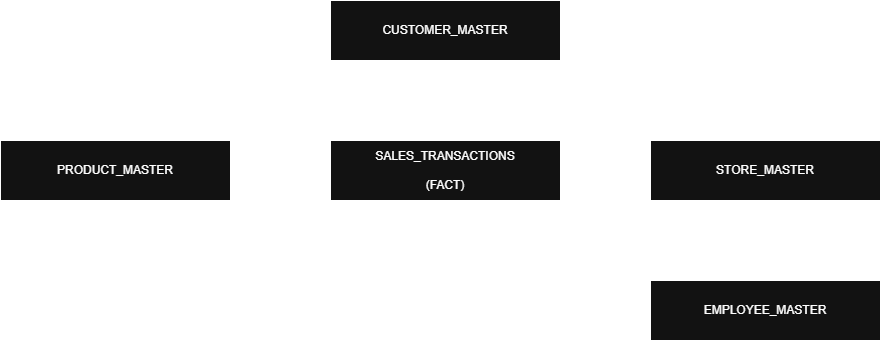
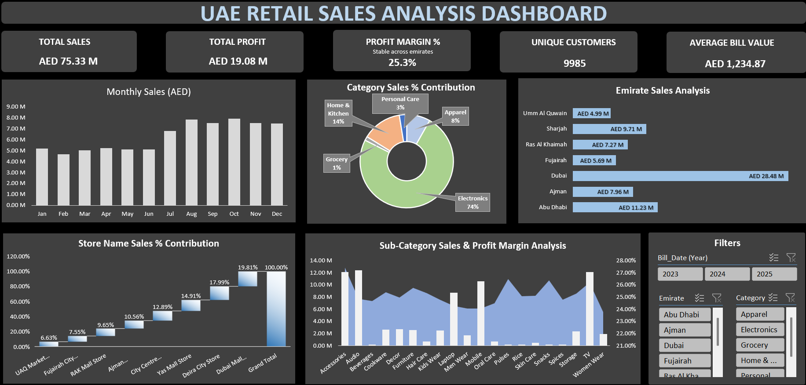

# 🧾 UAE Retail Sales Analysis

---

## 📌 Table of Contents
- <a href="#overview">Overview</a>
- <a href="#business-problem">Business Problem</a>
- <a href="#dataset">Dataset</a>
- <a href="#erd">Entity Relationship Diagram (ERD)</a>
- <a href="#data-cleaning-validation">Data cleaning & Validation</a>
- <a href="#tools--technologies">Tools & Technologies</a>
- <a href="#Key-Business-Questions-Answered">Key Business Questions Answered</a>
- <a href="#Key-Insights">Key Insights</a>
- <a href="#final-recommendations">Final Recommendations</a>
- <a href="#dashboard_preview">Dashboard Preview</a>
- <a href="#project-structure">Project Structure</a>
- <a href="#how-to-run-this-project">How to Run This Project</a>
- <a href="#author--contact">Author & Contact</a>

---
<h2><a class="anchor" id="overview"></a>Overview</h2>
The objective of this project is to analyze UAE retail sales performance across 7 emirates (including 2 stores in Dubai) to enable data-driven business decision-making. The analysis focuses on identifying revenue drivers, profitability trends, customer behavior, discount impact, and VAT compliance using Excel-based analytics.

The project delivers end-to-end retail analytics, covering:
   - Emirate-wise and store-level performance analysis
   - Product category and sub-category sales and profit margin analysis
   - Customer behavior and loyalty contribution assessment
   - Discount effectiveness and margin impact evaluation
   - VAT contribution validation aligned with UAE regulations

Data was cleaned and validated using Excel Power Query, modeled using the Excel Data Model (Power Pivot), and presented through an interactive executive dashboard designed for management-level insights. Backend, EDA, and Power Query sheets are intentionally hidden to maintain a clean dashboard experience.

---
<h2><a class="anchor" id="business-problem"></a>Business Problem</h2>
Regular sales analysis is critical for understanding the financial health of a retail business. Organizations need to continuously analyze transactional data to identify revenue drivers, profitability risks, and margin leakages across multiple business dimensions.

The key business challenges addressed in this project include:
   - Identifying sales and profitability performance across emirate, store, category, and sub-category levels.
   - Understanding category-wise sales contribution and corresponding profit margins.
   - Evaluating the impact of discounts on both sales volume and profitability across different dimensions.

The goal is to provide actionable insights that help management optimize pricing strategies, promotional effectiveness, and overall business performance.

---
<h2><a class="anchor" id="dataset"></a>Dataset</h2>
The dataset was generated using Python to simulate real-world UAE retail sales data and was created one time for analysis purposes. It represents transactional sales data across 7 emirates, with 2 stores in Dubai and 1 store in each remaining emirate.

The dataset includes the following components:
- Sales Transactions: ~61000 records covering individual retail transactions.
- Master Data Files:
   - Customer_Master
   - Employee_Master
   - Product_Master
   - Store_Master

- Additional Details:
   - File Format: Excel (.xlsx), analysis-ready
   - Time Period Covered: 2023-2025

This structured dataset supports multi-level analysis across emirates, stores, products, and customers, enabling accurate KPI calculation and dashboard-driven insights.

---
<h2><a class="anchor" id="erd"></a>Entity Relationship Diagram (ERD)</h2>

The Entity Relationship Diagram (ERD) represents a star schema data model with Sales Transactions as the central fact table connected to Customer, Product, and Store dimension tables. Employee data is linked at the store level to maintain correct granularity and support scalable retail analysis.



---
<h2><a class="anchor" id="data-cleaning-validation"></a>Data cleaning & Validation</h2>
The data cleaning and validation process was performed using Excel Power Query to ensure data accuracy, consistency, and reliability before analysis and dashboard creation.


Sales Transactions Cleaning
   - Sales transaction files from the Raw_Files folder were imported, appended, and consolidated into a single fact table named Final_Sales_Fact.
   - Duplicate transactions were identified and removed where entire rows were duplicated.
   - Null values in the Discount column were identified and replaced with 0 to ensure accurate sales and margin calculations.
   - Payment_Mode text inconsistencies were cleaned by trimming extra spaces and standardizing values (capitalization).

Master Data Validation
   - Customer_Master
      - Null values in the Age column were identified and replaced using the mode to maintain demographic consistency.
   - Product_Master and Store_Master
      - Validated for missing or inconsistent values; no major issues identified.

Feature Engineering
   - A Discount_Band column was created to enable discount impact and margin analysis across multiple dimensions.

Data Modeling
   - Master tables (Customer_Master, Product_Master, Store_Master) were loaded into Power Query and connected to Final_Sales_Fact using the Excel Data Model (Power Pivot).
   - Employee_Master was intentionally not merged with the sales fact table due to granularity mismatch and was retained separately for potential future workforce analysis.
   - A relational data model was created using one-to-many relationships, supporting accurate aggregation and scalable analysis.

---
<h2><a class="anchor" id="tools--technologies"></a>Tools & Technologies</h2>

   - Microsoft Excel – Power Query: Data cleaning, transformation, and validation.
   - Excel Data Model (Power Pivot) & DAX: KPI creation, measures, and relational modeling.
   - Pivot Tables & Advanced Charts: Exploratory Data Analysis (EDA) and trend analysis.
   - Executive Dashboard Design: KPI cards, sales trends, contribution and margin analysis.
   - Python (Pandas, Faker): One-time synthetic data generation to simulate real-world UAE retail transactions.
   - Business Storytelling & Stakeholder Reporting: Translating analytical insights into actionable business recommendations.

---
<h2><a class="anchor" id="Key-Business-Questions-Answered"></a>Key Business Questions Answered</h2>

   - Which emirates generate the highest and lowest sales and profit?
   - Which product categories and sub-categories are most and least profitable?
   - How does the loyalty program impact sales performance?
   - How do different discount bands affect sales volume and profit margins?
   - Is VAT applied consistently across products and categories in line with UAE regulations?
   - Which months show peak and low sales performance, indicating seasonality?
   - What is the sales contribution of individual stores to overall revenue?
   - Which stores and categories present opportunities for margin optimization?

---
<h2><a class="anchor" id="Key-Insights"></a>Key Insights</h2>

   - Dubai is the dominant revenue contributor, while Umm Al Quwain contributes the least. However, profit margins remain consistent across emirates (approximately 25–26%), indicating centralized pricing and cost control.
   - Electronics accounts for the majority of total sales, highlighting a high dependency on a single category and increasing category concentration risk.
   - Profit margins are stable across categories, with categories such as Grocery and Personal Care showing margins comparable to Electronics, despite lower sales volumes.
   - Non-discounted sales generate the highest profit margins (~29%), confirming that discounts lead to margin erosion even when sales volumes increase.
   - Loyal customers do not significantly outperform non-loyal customers in sales contribution, indicating that the current loyalty program is not effectively driving incremental revenue.
   - VAT contribution remains consistent (~5%) across all categories and emirates, confirming correct application and compliance with UAE VAT regulations.

---
<h2><a class="anchor" id="final-recommendations"></a>Final Recommendations</h2>

   - Reduce dependency on Electronics by actively promoting other high-margin categories such as Grocery and Personal Care to improve revenue diversification.
   - Optimize discount strategies by limiting aggressive discounting and focusing on targeted promotions to protect profit margins.
   - Re-evaluate the loyalty program, as loyal customers are not generating higher sales; redesign incentives to drive repeat purchases and higher average bill value.
   - Expand growth initiatives beyond Dubai to improve regional balance and reduce geographic concentration risk.
   - Maintain existing VAT processes, as tax application is consistent and compliant with UAE regulations.
   - Adopt margin-focused decision-making, prioritizing categories and products that deliver sustainable profitability rather than only high sales volume.

---
<h2><a class="anchor" id="dashboard_preview"></a>Dashboard Preview</h2>

The dashboard presents key retail KPIs, sales trends, regional performance, product contribution, and margin analysis. Interactive slicers allow filtering by year, category, and emirate to support executive-level decision-making. 
The dashboard is supported by hidden EDA and backend sheets to ensure a clean executive-facing layout.



---
<h2><a class="anchor" id="project-structure"></a>Project Structure</h2>

```
UAE-Retail-Sales-Excel-Analysis/
│
├── README.md
│
├── excel/
│   └── Analysis_Master.xlsx
│
├── docs/
│   └── UAE_Retail_Sales_Executive_Report.pdf
│
├── data_generation/
│   └── Data_Generation.ipynb
│
├── masters/
│   ├── Customer_Master.xlsx
│   ├── Employee_Master.xlsx
│   ├── Product_Master.xlsx
│   ├── Store_Master.xlsx
│
├── raw_files/
│   ├── Sales_Transactions_DXB_01.xlsx
│   ├── Sales_Transactions_DXB_02.xlsx
│   ├── Sales_Transactions_AJM_01.xlsx
│   ├── Sales_Transactions_AUH_01.xlsx
│   ├── Sales_Transactions_FUJ_01.xlsx
│   ├── Sales_Transactions_RAK_01.xlsx
│   ├── Sales_Transactions_SHJ_01.xlsx
│   └── Sales_Transactions_UAQ_01.xlsx
│
├── assets/
│   ├── UAE_Retail_Sales_ERD_Diagram.png
│   └── UAE_Retail_Sales_Excel_Dashboard.png
```
---
<h2><a class="anchor" id="how-to-run-this-project"></a>How to Run This Project</h2>

Step 1. Clone the repository:
```bash
git clone https://github.com/rahulpatel0890/UAE-Retail-Sales-Excel-Analysis.git
```

Step 2: Open the Excel Analysis File
   - Navigate the excel/ folder
   - Open Analysis_Master.xlsx

This file contains:
   - Complete data cleaning (Power Query)
   - Relational data model (Power Pivot)
   - DAX based KPIs
   - Final Executive Dashboard

Step 3: View the dashboard
   - Go to Dashboard
   - Use slicers (Year, Category, Emirate) to interact with the visuals
   - All KPIs and charts updated dynamically

Step 4: Hidden Backend & EDA Sheets (Optional - Advanced Users)
To maintain dashboard clarity, backend and EDA sheets are intentionally hidden
Hidden sheets include:
   - Final_Sales_Fact
   - EDA_Emirate_Analysis
   - EDA_Product_Analysis
   - EDA_Customer_Analysis
   - EDA_Discount_VAT_Analysis
   - EDA_Store_Analysis
   - Dashboard_Backend
   - PQ_Employee_Master
   - PQ_Store_Master
   - PQ_Product_Master
   - PQ_Customer_Master

👉 These sheets contain:
   - Exploratory Data Analysis (EDA)
   - Supporting pivot tables
   - Power Query outputs
   - Data Model staging tables

These can be unhidden if detailed analysis or learning is required.

Step 5(Optional): Review Documentation
   - Refer to the docs/ folder for the Executive Summary PDF
   - View ERD and dashboard images in the assets/ folder

---
<h2><a class="anchor" id="author--contact"></a>Author & Contact</h2>

**Rahul Patel**  
Data Analyst  
📧 Email: rahul.patel0890@gmail.com
🔗 [LinkedIn](https://www.linkedin.com/in/rahul-patel-analyst/)
